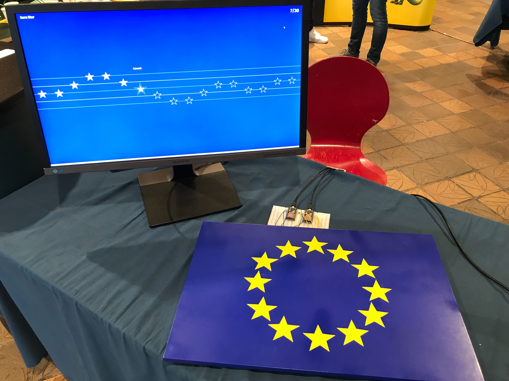

# Euro Star Piano powered by tingg.io

The project uses https://tingg.io platform. 

For the complete project guide go to the [docs](docs/index.md).

## Getting started

### Project configuration: `.env` file

1. In the `.env` add piano thing IDs. You will have them after you create a piano thing on the platform.
2. Login to https://tingg.io and find your authentication token. It is located in your cookies under `tng_auth` name. Save it to `.env` file.
3. Run `npm install` to install project dependencies
4. Run `npm start` to run the application

The application should automatically open. If it didn't, it's located at http://localhost:3000
