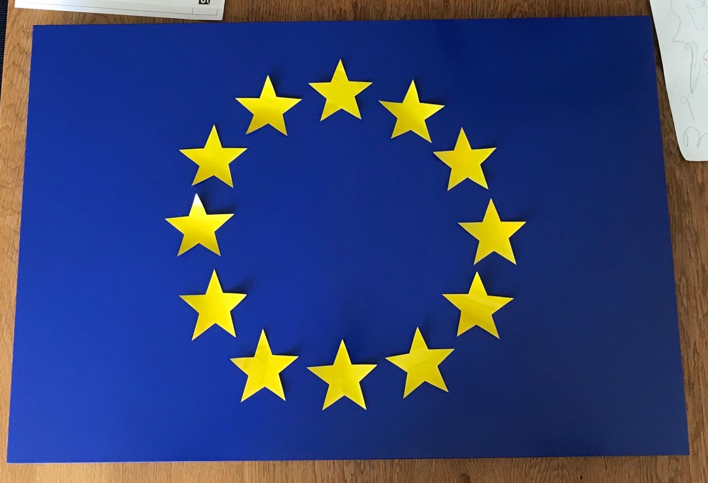
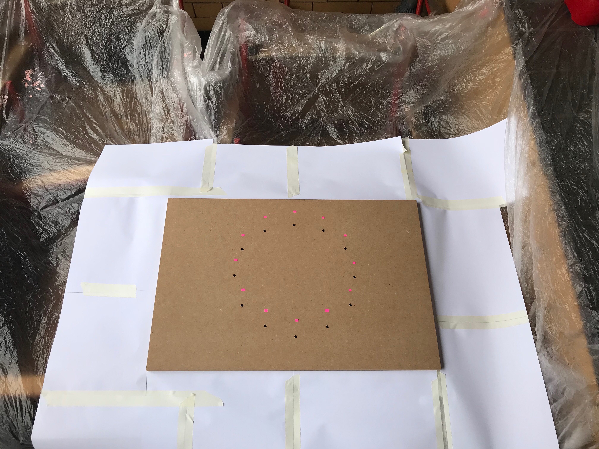
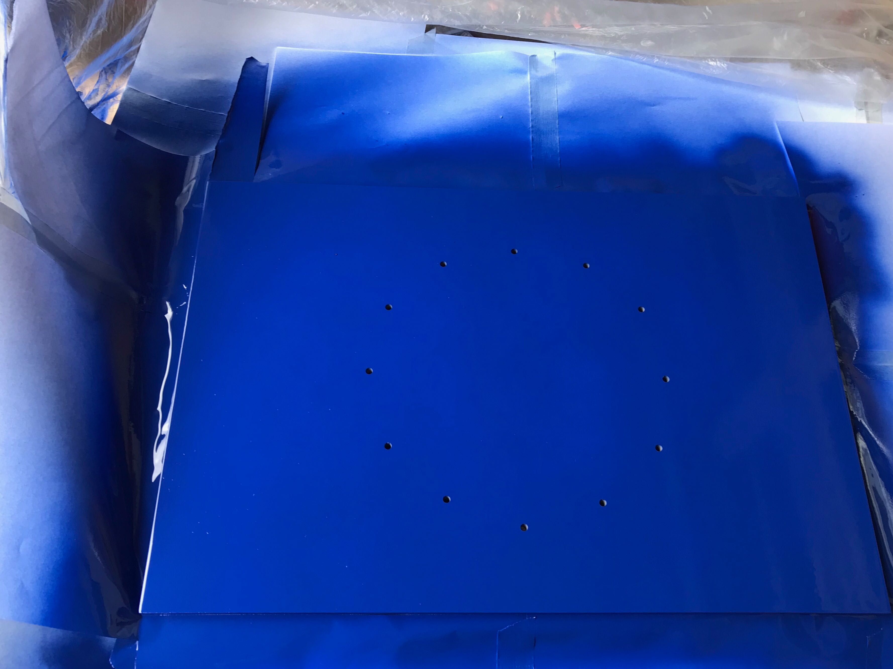
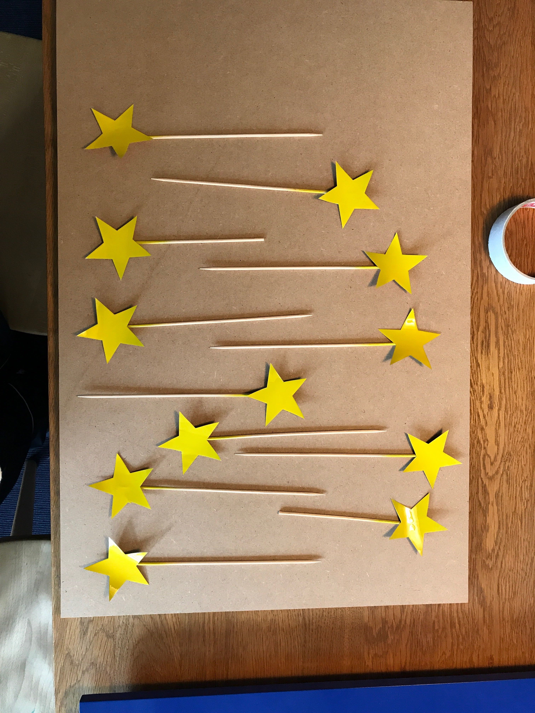
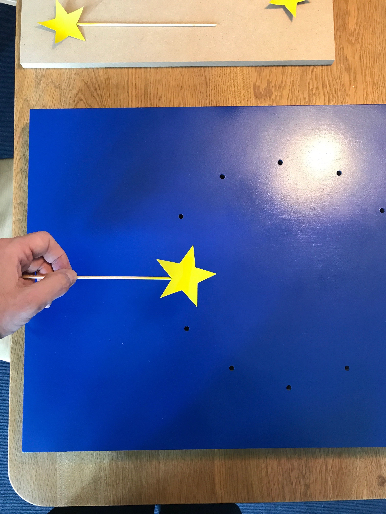
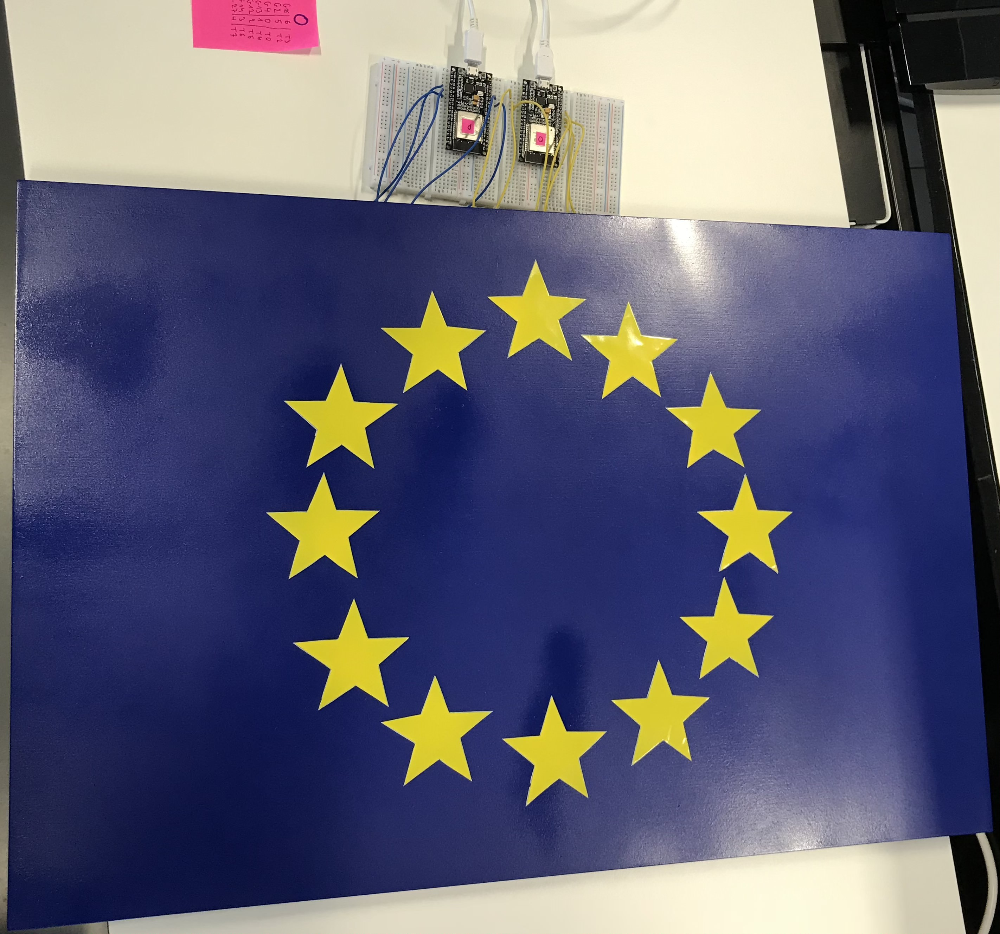
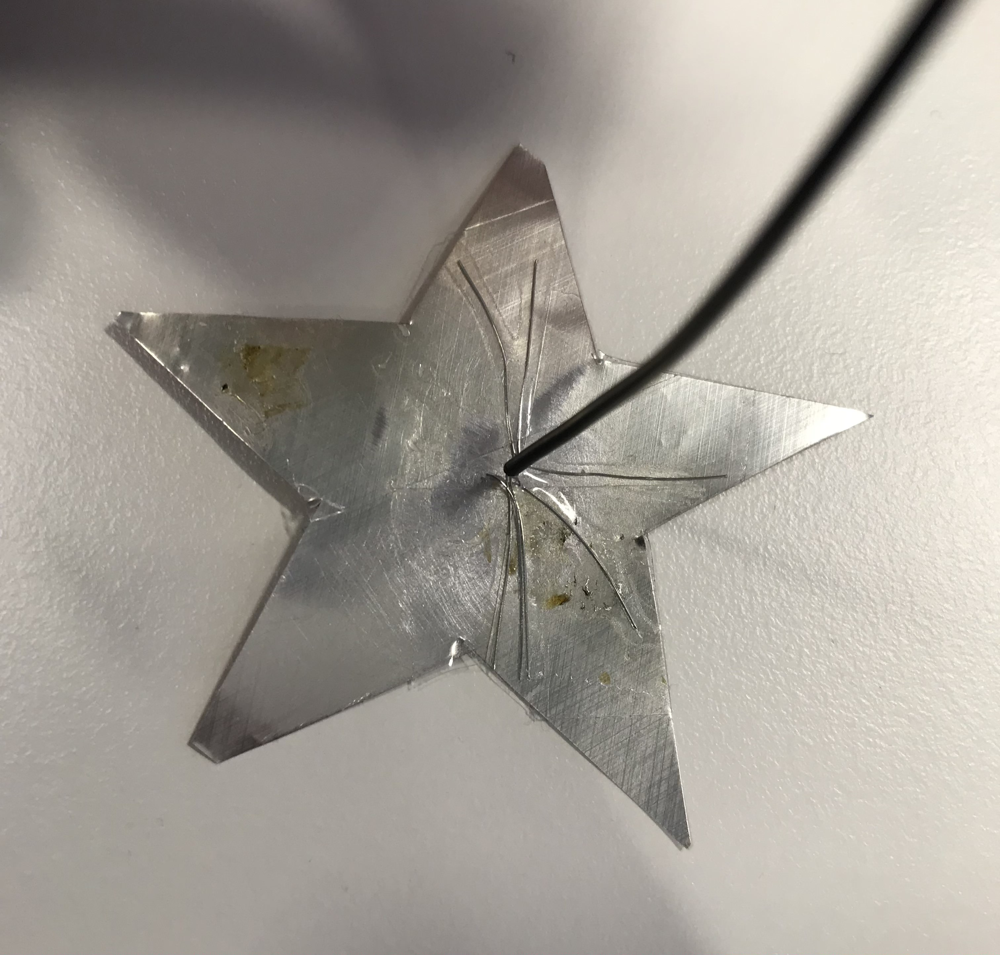
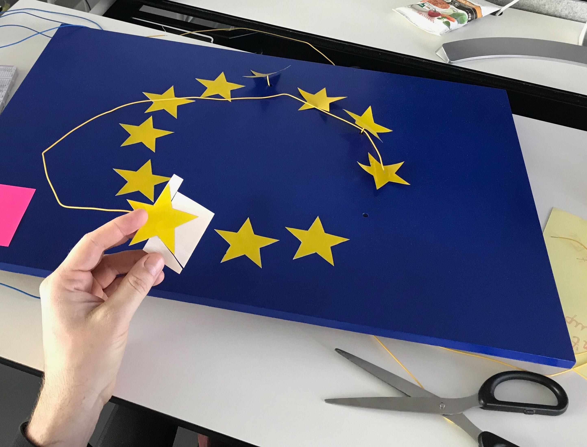

## How to build

### The Board and the Stars

First, we will prepare the wooden board and make it look like the EU flag.
Start by gluing four legs at the bottom side. One in each corner. Use glue for wood or even super glue should do the work. Let it dry to make sure it stays in place.
Now drill 12 holes around the center. Holes will be used to attach the wire to the star, so make sure hold is big enough so that your wires can pass through.

The next step is to spray paint the board in blue. Optional: you can use some base spray paint before spraying it in blue.

Now use the aluminum sheet and a pen and make a pattern for all 12 stars. Use scissors and cut out the stars.
After you have 12 stars, place them on a protected surface and spray paint them in yellow.

### Connecting esp32s and the board

In this step, we will connect the stars with esp32 microcontrollers.

Start by cutting the wires at the appropriate length. Measure from each hole to the top of the board like in the final photo, you can add a bit more length just to be safe and trim later.
On one end, strip 2 cm of wire coating and use single-sided adhesive tape to hold it in place. If the tape is going "outside" the star, trim it with scissors. 
Tip: this connecting needs to be very tight, so make sure the tape holds it firmly in place, otherwise touch will not be detected.

After you taped all wires with stars, it's time to tape stars to the board. We will do that by applying double-sided adhesive tape on the bottom of the stars. Trim excess tape in the shape of a star. Pull the wire through the hole and tape the star to the board. Press hard to make a good connection. Do this for each star.

Now at the other end of the wire, remove 1cm of wire coating and twist the wire so that it can be easily attached to the breadboard. Optional: if you have a soldering iron, you can tin the end.

Optional: you can tape the wires on the bottom side of the board to hold them in place.

## Sending data to tingg.io

Go to https://tingg.io and create an account. We will use the platform to send data which will be consumed by piano UI application.
Create two things (piano board and funny board). To each of them, add one resource "note" with type "integer" and method "Publish data". You can find more info on how to do it here: https://docs.tingg.io/#developer%20console

### Piano esp32 code

You can find the code for sending data from the board to the platform in the project root [piano-board.ino](../piano-board.ino).
In the file you need to enter your configuration for:

Description | variable
--- | ---
WiFi ssid | `ssid`
WiFi password | `password`
Thing ID | `thing_id`
Thing key | `key`
Touch pin map | `PIN_MAP`

You can use the same code for multiple boards, just remember to enter a different `thing_id` and `key`.
When you upload the code to esp32, it should start sending data when you touch any configured touch pin. 
Go to the [console](https://console.tingg.io) and check if you are getting the data. 
